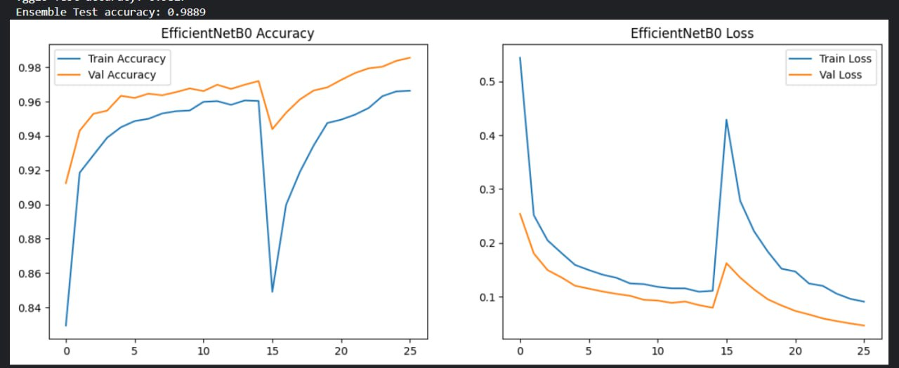
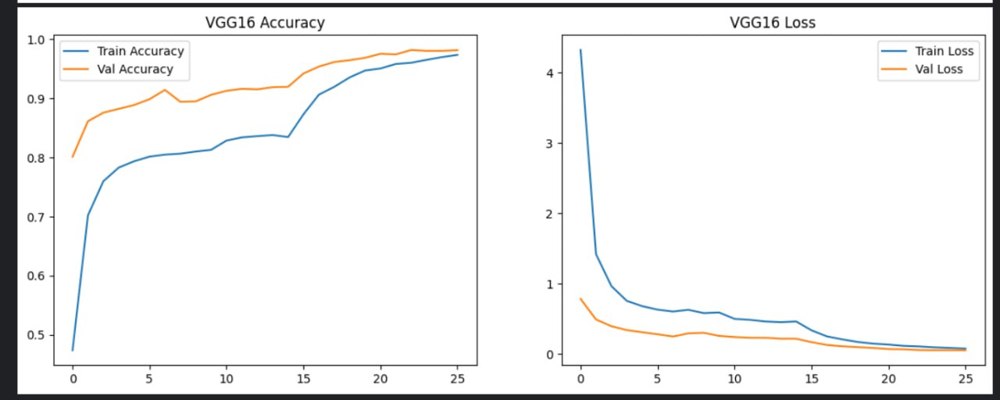

# Fruit-classification-CV-model
CNN model using efficientnetB0 and VGG16

🍎 Fruit Ripeness Classification using Transfer Learning & Ensembling
📌 Project Overview

This project builds a deep learning system to classify fruit images into ripeness categories (ripe, unripe, rotten).

The model leverages transfer learning with pretrained convolutional neural networks and applies fine-tuning and ensemble averaging to improve performance and generalization.

🧠 Models Used

EfficientNetB0 (feature extraction + fine-tuning)

VGG16 (feature extraction + fine-tuning)

Both models were pretrained on ImageNet and adapted for fruit ripeness classification.

🔬 Methodology

Dataset preprocessing and stratified split (60/20/20)

Data augmentation (rotation, zoom, shifts, flips)

Transfer learning (frozen base layers)

Fine-tuning selected layers

Early stopping & learning rate scheduling

Model ensembling via probability averaging

⚙️ Training Details

Input size: 224x224

Batch size: 32

Optimizer: Adam

Loss: Sparse Categorical Crossentropy

Evaluation metric: Accuracy

📊 Model Performance

EfficientNet Test Accuracy: 98.34%

VGG16 Test Accuracy: 97.88%

Ensemble Test Accuracy: 98.889%

🍌🍎🍊 Model Description
🔍 How the Model Works

This project implements a deep learning system that classifies fruit images into three categories:

Banana

Apple

Orange

Each fruit is further classified based on ripeness (e.g., ripe, unripe, rotten).

The model takes an input image (224×224 resolution), processes it through a pretrained convolutional neural network, extracts high-level visual features (such as texture, color distribution, and shape patterns), and outputs a probability score for each class using a softmax layer.

🧠 Architecture Overview

The system uses transfer learning with two pretrained CNN architectures:

EfficientNetB0

VGG16

Both models were pretrained on ImageNet and loaded with their respective pretrained weights.

Initial training:

Base model layers frozen (feature extraction mode)

Custom classification head added

Dropout applied for regularization

Fine-tuning stage:

Selected deeper layers unfrozen

Lower learning rate applied

Model optimized for fruit ripeness classification

Finally, an ensemble was created by averaging prediction probabilities from both models to improve generalization and reduce variance.

📂 Dataset

The dataset was obtained from Kaggle.

It contains labeled images of:

Bananas

Apples

Oranges

Each categorized by ripeness condition.

📌 Dataset Source:
https://www.kaggle.com/datasets/leftin/fruit-ripeness-unripe-ripe-and-rotten

⚙️ Pretrained Weights Used

EfficientNetB0 pretrained weights (ImageNet)

VGG16 pretrained weights (ImageNet)

Exact weight files used in Kaggle environment:

efficientnetb0_notop.h5

vgg16_weights_tf_dim_ordering_tf_kernels_notop.h5

🌐 Full Project Availability

The complete project with a completed UI using Netlify is now available in Amharic language  
https://fruit-ripeness-detector-app.netlify.app/
